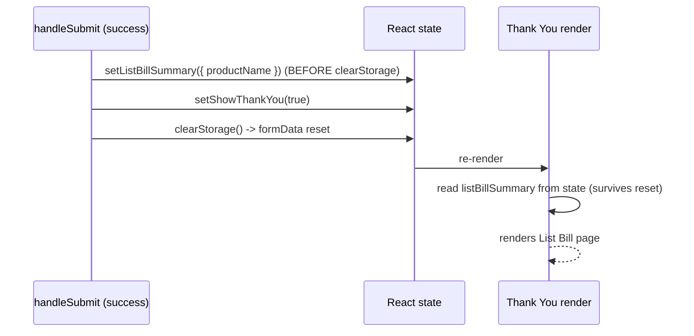

# List Bill Thank You Page — Replication Runbook

This document describes how to replicate the **List Bill–specific Thank You page** in another enrollment project that already has (or will have) the **List Bill payment option** from [`ListBill.md`](./ListBill.md).

**CareEnrollment (this repo):**

| Piece | File |
|-------|------|
| Thank You UI (regular + List Bill branch) | `src/components/ThankYouPage.tsx` |
| Snapshot summary + route to Thank You | `src/components/EnrollmentWizard.tsx` |
| Dev-only preview route | `src/App.tsx` (`/preview-listbill-thankyou`) |

---

## What this feature does

After a **successful List Bill enrollment** (`paymentMethod === 'list-bill'`), the wizard shows a **different Thank You page** than Credit Card or ACH. The List Bill page is intentionally **minimal**:

| Element | Content |
|---------|---------|
| Title | `Thank you!` |
| Text | `Your enrollment to MPB Health has been completed.` |
| Subtitle | `Product` |
| Text | the product name (e.g. `Care+`) |

**Design rules:**

- **No buttons** on the List Bill Thank You page (no "Access Your Health Benefits" link).
- **Regular enrollments unchanged** — when `listBill` is not passed, the existing Thank You page (welcome copy + CTA button) renders exactly as before.
- List Bill detection uses **`formData.payment.paymentMethod === 'list-bill'`**, not the URL param alone (the user may have selected List Bill because `employeegroup=LB` forced it in Step 3).

---

## ⚠️ CRITICAL: snapshot the List Bill decision BEFORE clearing form data

This is the mistake to avoid. On a successful submit the wizard typically does:

```tsx
setShowThankYou(true);
clearStorage();   // <-- resets formData to defaults (paymentMethod back to 'credit-card')
```

If the Thank You render computes `isListBill` from **live** `formData` at render time, it will read the **reset** value and always fall through to the regular page — the List Bill page never appears. (This is a real bug that shipped previously in CareEnrollment.)

**Fix:** capture the List Bill summary into React **state** in the success handler, **before** `clearStorage()`, and render from that state.



---

## Prerequisites

Before implementing this runbook, the target project should already have:

1. **List Bill payment** — see [`ListBill.md`](./ListBill.md): `paymentMethod: 'list-bill'`, `paymentType: 'LB'`, Step 3 gating via `employeegroup=LB`, edge function `PAYMENTTYPE: "LB"`.
2. **A Thank You step** — wizard sets `showThankYou = true` after successful submit and renders a `ThankYouPage` (or equivalent).
3. **A submit handler that clears form data on success** (the reason the snapshot is required).

---

## ⚠️ FIRST: Information the AI must collect before implementing

**AI: Before writing any code, STOP and ask the user the following. Do not assume.**

1. **Which product name to show.** CareEnrollment uses the `care-plus` product's `name`, falling back to the first product. Ask:
   > "Which product should the List Bill Thank You page name (primary product id), and what text should it show?"
2. **Branding copy.** Default is `"Your enrollment to MPB Health has been completed."` Ask:
   > "Keep MPB Health wording or use a different organization name?"
3. **Does the submit flow reset form data on success?** If yes (almost always), the snapshot-before-clear step below is mandatory.

Only after these answers should the AI proceed.

---

## Architecture / data flow

```
Successful submit
  └─ EnrollmentWizard handleSubmit
       ├─ paymentMethod === 'list-bill' ?
       │     └─ setListBillSummary({ productName })   ← BEFORE clearStorage()
       ├─ setShowThankYou(true)
       └─ clearStorage()                              ← resets formData
  └─ render: <ThankYouPage listBill={listBillSummary} />   ← from state, not live formData
```

The URL parameter `employeegroup=LB` is **not** read on the Thank You page; only the snapshotted **`paymentMethod === 'list-bill'`** selects the List Bill layout.

---

## 1. Types — `ListBillSummary` (in `ThankYouPage.tsx`)

```ts
export interface ListBillSummary {
  productName: string;
}

interface ThankYouPageProps {
  enrollmentData: {
    firstName: string;
    email: string;
  };
  pdfUrl?: string | null;
  listBill?: ListBillSummary | null;
}
```

---

## 2. `ThankYouPage.tsx` — conditional layout

**Pattern:** if `listBill` is truthy, render the minimal List Bill layout and **return early**. Otherwise render the existing Thank You unchanged.

**Imports:** only `CheckCircle` from `lucide-react` is needed for this branch.

**List Bill layout structure:**

1. Same outer shell as regular page: `min-h-screen bg-gradient-to-br from-green-50 via-blue-50 to-white`, white card `rounded-2xl shadow-xl`.
2. Centered header: green check icon, **Thank you!**, completion sentence.
3. One **left-aligned** section, `rounded-xl border border-gray-200 p-5`:
   - Subtitle `Product` (`h2`), then `<p>{listBill.productName}</p>`.
4. **No buttons**, no footer CTA, no PDF download on this branch.

```tsx
if (listBill) {
  return (
    <div className="min-h-screen bg-gradient-to-br from-green-50 via-blue-50 to-white flex items-center justify-center p-4">
      <div className="max-w-2xl w-full">
        <div className="bg-white rounded-2xl shadow-xl p-8 md:p-12">
          <div className="text-center">
            <div className="inline-flex items-center justify-center w-20 h-20 bg-green-100 rounded-full mb-6">
              <CheckCircle className="w-12 h-12 text-green-600" />
            </div>
            <h1 className="text-3xl md:text-4xl font-bold text-gray-900 mb-3">Thank you!</h1>
            <p className="text-lg text-gray-700 mb-8">
              Your enrollment to MPB Health has been completed.
            </p>
          </div>
          <div className="text-left">
            <section className="rounded-xl border border-gray-200 p-5">
              <h2 className="text-xl font-semibold text-gray-800 mb-2">Product</h2>
              <p className="text-gray-900">{listBill.productName}</p>
            </section>
          </div>
        </div>
      </div>
    </div>
  );
}
```

---

## 3. `EnrollmentWizard.tsx` — snapshot the summary in the success handler

Add state and populate it **before** `clearStorage()` in the success path (NOT at render time):

```tsx
const [listBillSummary, setListBillSummary] = useState<ListBillSummary | null>(null);

// ...inside handleSubmit, when enrollmentSuccess is true:
if (formData.payment.paymentMethod === 'list-bill') {
  const carePlusProduct = formData.products.find(p => p.id === 'care-plus');
  const productName = carePlusProduct?.name || formData.products[0]?.name || 'Care+';
  setListBillSummary({ productName });
} else {
  setListBillSummary(null);
}

setShowThankYou(true);
clearStorage();
```

Render from the snapshot (no recomputation from `formData`):

```tsx
if (showThankYou) {
  return (
    <ThankYouPage
      enrollmentData={{ firstName: formData.firstName, email: formData.email }}
      pdfUrl={pdfUrl}
      listBill={listBillSummary}
    />
  );
}
```

**Important:** replace `care-plus` with the target project's primary product id.

---

## 4. Dev preview route (optional but recommended)

Add a **dev-only** route so designers/QA can view the List Bill Thank You without completing an enrollment.

```tsx
if (import.meta.env.DEV && currentPath === '/preview-listbill-thankyou') {
  return (
    <ThankYouPage
      enrollmentData={{ firstName: 'Jane', email: 'jane.doe@example.com' }}
      listBill={{ productName: 'Care+' }}
    />
  );
}
```

**Local preview:** `npm run dev` → open `http://localhost:5173/preview-listbill-thankyou`

This route is **not** included in production builds (`import.meta.env.DEV` is false).

---

## 5. What NOT to change

| Do not change | Reason |
|---------------|--------|
| Regular Thank You JSX (ACH / CC branch) | Users expect existing welcome + app link |
| List Bill Step 3 payment UI | Covered in [`ListBill.md`](./ListBill.md) |
| Edge function | Thank You is frontend-only; LB payload unchanged |
| Thank You trigger on `employeegroup` alone | Snapshot `paymentMethod` at submit time instead |

---

## Verification checklist

1. Complete a **List Bill** enrollment (`?employeegroup=LB` → submit successfully).
2. Thank You shows **Thank you!**, the completion sentence, and a **Product** section with the product name — **no buttons**.
3. Confirm the List Bill page actually renders (this is the snapshot fix — verify it does not fall through to the regular page after `clearStorage`).
4. Complete enrollment with **Credit Card** or **ACH** (no `employeegroup=LB`).
5. Thank You shows the **original** page with welcome copy and **Access Your Health Benefits** (or your project's CTA).
6. Dev preview URL renders the List Bill layout with sample data.
7. `npm run build` succeeds.

---

## Related docs

| Document | Purpose |
|----------|---------|
| [`ListBill.md`](./ListBill.md) | List Bill payment option (Step 3 + edge function) — **implement first** |
| [`ListBillThankYou.md`](./ListBillThankYou.md) | This file — List Bill Thank You page only |

---

## Quick copy-paste prompt for another repo

> Implement the List Bill Thank You page per `docs/ListBillThankYou.md`. Assume List Bill payment from `docs/ListBill.md` is already in place. Add `ListBillSummary { productName }` to ThankYouPage, branch on the `listBill` prop (minimal layout: Thank you! + completion text + Product + product name, no buttons). In the wizard, snapshot `listBillSummary` into state in the success handler BEFORE `clearStorage()` resets form data, and render from that state. Add dev route `/preview-listbill-thankyou`. Do not change the regular ACH/Credit Card Thank You page.
